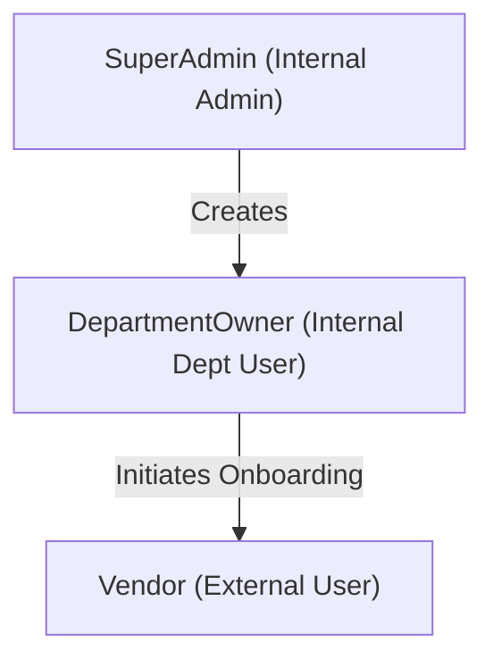
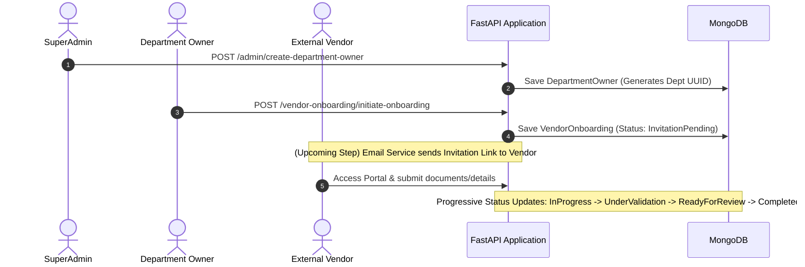

# Vendor Registration & Onboarding System — Architecture & Project Specification

## 1. System Overview & Context

The **Vendor Registration & Onboarding System** is an internal enterprise application designed to orchestrate and streamline vendor onboarding for an organization. 

> **Important Business Context**:
> - This application is **NOT a SaaS product**. It is an **internal organizational tool**.
> - It is **NOT** a public self-signup portal for administrative roles.
> - Onboarding begins internally when a Department Owner initiates a vendor request.

---

## 2. Core User Roles & Permissions



### 1. SuperAdmin
- **Role**: Organization-level Administrator.
- **Registration**: **Not publicly registrable**. Created out-of-band or seeded.
- **Capabilities**:
  - Manages system configuration and users.
  - Creates and manages **Department Owners**.
  - Has full visibility across all vendor onboarding requests.

### 2. DepartmentOwner
- **Role**: Internal organizational user belonging to a specific department (e.g., Procurement, IT, Finance).
- **Registration**: **No public registration**. Created exclusively by a `SuperAdmin`.
- **Capabilities**:
  - Assigned a single department (represented via nested `Department` details).
  - Initiates vendor onboarding requests by providing initial vendor details (Name, Email, Phone).

### 3. Vendor
- **Role**: External supplier / vendor.
- **Registration**: Initiated by a `DepartmentOwner`. The vendor later accesses the portal via invitation to supply complete company profile data and documentation.
- **Capabilities**:
  - Completes progressive data enrichment during onboarding.

---

## 3. End-to-End Business Flow



### Status Lifecycle Enum / Literal Values:
1. `InvitationPending` (Default state upon creation)
2. `InvitationSent`
3. `InProgress`
4. `InformationRequired`
5. `DocumentsRequired`
6. `UnderValidation`
7. `ReadyForReview`
8. `Completed`

---

## 4. Architectural Patterns & Directory Structure

The system follows a strict **Layered Architecture Pattern**:

$$\text{Controller (FastAPI Router)} \longrightarrow \text{Service (Business Logic)} \longrightarrow \text{Repository (Data Access)} \longrightarrow \text{MongoDB}$$

### Directory Structure Map:

```
VendorRegistration/
├── main.py                                      # FastAPI entry point & Router registration
├── Config/                                       # Environment & logging config
├── src/
│   └── VendorRegistrationAndOnboarding/
│       ├── Controllers/                         # Request routing & API handlers
│       │   ├── AdminController.py               # SuperAdmin routes (/admin)
│       │   ├── AuthController.py                # Authentication routes (/auth)
│       │   ├── UserController.py                # User query routes (/users)
│       │   └── VendorOnboardingController.py    # Onboarding routes (/vendor-onboarding)
│       ├── Services/                            # Core business logic
│       │   ├── AuthService.py                   # Auth & password verification logic
│       │   ├── UserService.py                   # User management logic
│       │   └── VendorOnboardingService.py       # Onboarding workflow logic
│       ├── Repositories/                        # MongoDB operations
│       │   ├── UserRepository.py                # Users collection queries
│       │   └── VendorOnboardingRepository.py    # VendorOnboardings collection queries
│       ├── DTOs/                                # Pydantic schemas (Data Transfer Objects)
│       │   ├── AuthDTO.py                       # Login / Register schemas
│       │   ├── DepartmentOwnerDTO.py            # Admin creation schema
│       │   ├── UserDTO.py                       # Base & specific User schemas
│       │   └── VendorOnboardingDTO.py           # Onboarding request/response schemas
│       ├── MongoHandler/                        # Database Connection Singleton
│       │   └── Handler.py                       # PyMongo client handler
│       ├── Agents/                              # Placeholder for future AI Agent modules
│       ├── utils/                               # Helper utilities (hashing, env loaders)
│       └── configurations/                      # System config managers
```

---

## 5. Domain Models & Data Specifications

### Key Rules:
1. **Primary Keys (`_id`)**: Always stored and generated as **MongoDB String UUIDs** (`str(uuid.uuid4())`), **NOT** BSON `ObjectId`.
2. **Audit Fields**: All documents maintain `CreatedAt` (UTC datetime), `UpdatedAt` (UTC datetime), and `IsDeleted` (boolean soft delete).
3. **Password Security**: Passwords are hashed using **Argon2** (`argon2-cffi`).

### Document Schemas

#### Collection: `Users`
```json
{
  "_id": "945acf12-3df8-4853-afac-f0db1d85e9a8",
  "Email": "john.doe@kalsoft.com",
  "FirstName": "John",
  "LastName": "Doe",
  "UserType": "DepartmentOwner", // "SuperAdmin" | "DepartmentOwner" | "Vendor"
  "Password": "$argon2id$v=19$m=65536,t=3,p=4$...",
  "Department": {               // Present only for DepartmentOwner
    "DepartmentId": "c88f98d4-53c4-4b92-b43e-7c5efef7021a",
    "DepartmentName": "Procurement"
  },
  "CreatedAt": "2026-08-18T00:00:00Z",
  "UpdatedAt": "2026-08-18T00:00:00Z",
  "IsDeleted": false
}
```

#### Collection: `VendorOnboardings`
```json
{
  "_id": "e6a2b851-4f11-4091-a12b-31d25ffdfc82",
  "PRNumber": null,               // Basic external input reference
  "VendorName": "Acme Supplies Ltd",
  "VendorEmail": "contact@acmesupplies.com",
  "VendorPhone": "+1234567890",
  "CreatedBy": "945acf12-3df8-4853-afac-f0db1d85e9a8", // DepartmentOwner User ID
  "Status": "InvitationPending",
  "CreatedAt": "2026-08-18T00:00:00Z",
  "UpdatedAt": "2026-08-18T00:00:00Z",
  "IsDeleted": false
}
```

---

## 6. API Endpoint Inventory

| Method | Endpoint | Router / Controller | Description | Access / Role |
| :--- | :--- | :--- | :--- | :--- |
| `POST` | `/admin/create-department-owner` | `AdminController` | Creates a new Department Owner with generated Department UUID | SuperAdmin |
| `POST` | `/vendor-onboarding/initiate-onboarding` | `VendorOnboardingController` | Initiates vendor onboarding request (`Status: InvitationPending`) | DepartmentOwner |
| `POST` | `/auth/signup` | `AuthController` | Self-registration endpoint for external Vendors | Vendor |
| `POST` | `/auth/login` | `AuthController` | Authenticates users (SuperAdmin, DeptOwner, Vendor) | Public / All |
| `GET` | `/users/get_all_users` | `UserController` | Fetches active users (`IsDeleted: false`) | Admin |
| `GET` | `/api/health` | `main.py` | Health check endpoint | Public |

---

## 7. Operational Guidelines for Future AI Agents & Developers

1. **Authentication Separated from Domain DTOs**: Keep `AuthDTO` (`Register`, `Login`) decoupled from `UserDTO` domain models.
2. **No Public Admin Registration**: Never create public registration endpoints for `SuperAdmin` or `DepartmentOwner`.
3. **Primary Key Format**: Do **NOT** revert to PyMongo `ObjectId`. Maintain `str(uuid.uuid4())` string IDs.
4. **Out of Scope (For Now)**:
   - AI Document Processing & Extraction
   - Business Central Integration
   - Vendor Evaluation Rules
   - Procurement / PR Creation System (PR info is purely an external input)
